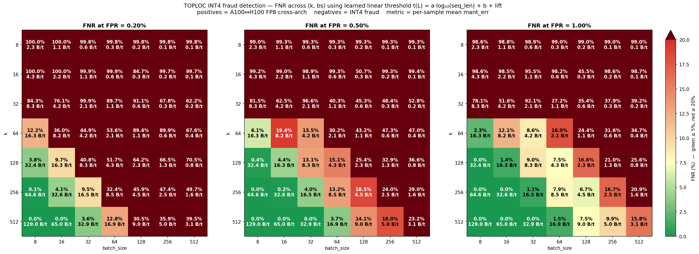
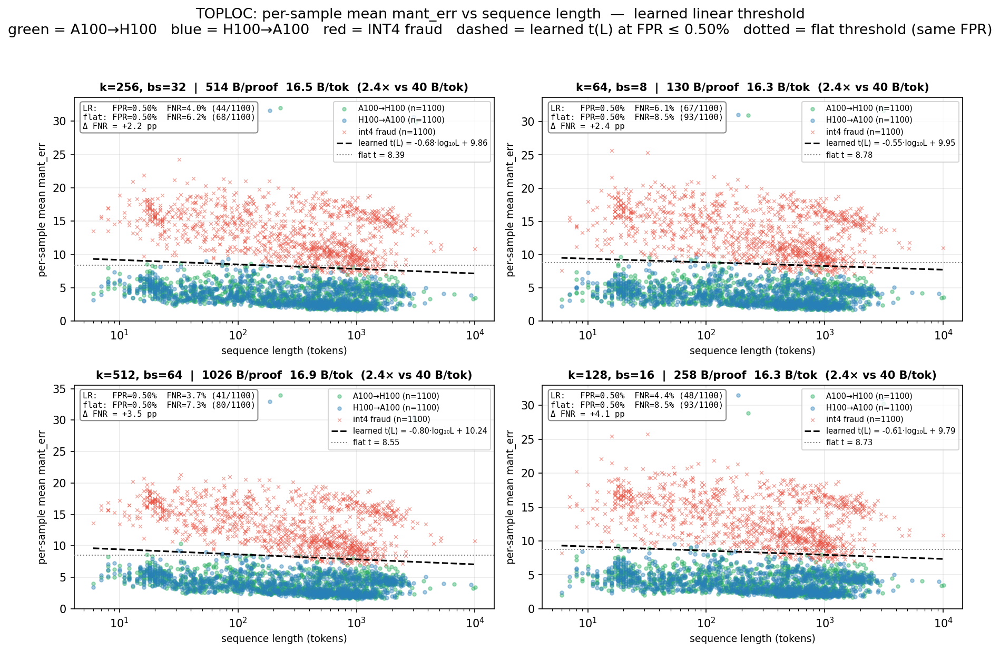
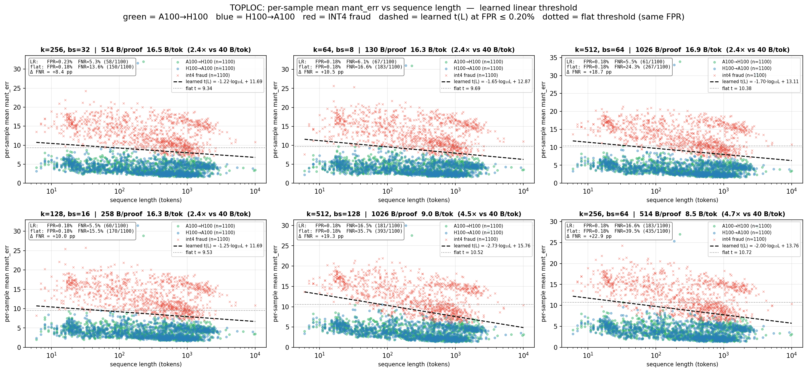

# TOPLOC for Gonka inference validation — research summary

Results from offline TOPLOC benchmarks on Qwen3-235B-A22B-Instruct-2507,
evaluating cross-architecture proof verification (A100 ↔ H100, FP8
weights) against cross-quantization fraud (INT4-served-as-FP8) across 49
(k, decode_batch_size) configurations on 1100 multilingual prompts.


##  TOPLOC in a nutshell

For a batch of B decode tokens, take the top-k indices and bf16 values of
the final hidden state, fit a unique polynomial of degree ≤ k-1 over
GF(p) with p=65497 to those (index, raw-uint16) pairs, and store its `2k+2`
bytes of coefficients. Verification re-computes the same top-k on the
verifier's activations, evaluates the polynomial at those indices, and
compares the resulting bf16 bit patterns field-by-field (exponent +
mantissa). The comparison is bit-level rather than value-level: the
verifier checks whether the exponent integer and the mantissa-bit
distance match, not whether the floating-point values are close.

## Setup

- **Model**: Qwen3-235B-A22B-Instruct-2507 (MoE, 235B total / 22B active,
  hidden_dim=4096, 94 layers, vocab 151 936). FP8 weights + FP8 KV cache
  in vLLM.
- **Negative-control variant**: `Qwen3-235B-A22B-Instruct-2507-INT4-W4A16`
  (community GPTQ INT4 quant of the same checkpoint).
- **Prompts**: 1100 from `prompts_all.json` (multilingual Bactrian-X
  +  ~100 long-output prompts). Sequence-length statistics:
  - FP8 H100 free: mean 583 / median 385 / max 9240 tokens
  - FP8 A100 free: mean 590 / median 384 / max 10042 tokens
  - INT4 H100 free: mean 578 / median 374 / max 10004 tokens
- **Hardware**: 4×H100 (Hopper) and 4×A100 (Ampere), TP=4 in both cases.
- **TOPLOC instrumentation**: top-512 hidden states collected per generated
  token; (k, bs) sweep then evaluated **offline** without re-running
  inference (49 configurations: k ∈ {8, 16, 32, 64, 128, 256, 512} ×
  bs ∈ {8, 16, 32, 64, 128, 256, 512}).

### The four runs

| # | Reference (free) | Verification (enforced) | What it tests              |
|:-:|------------------|-------------------------|----------------------------|
| 1 | FP8 / 4×H100     | FP8 / 4×H100            | Same model, same hardware  |
| 2 | INT4 / 4×H100    | FP8 / 4×H100            | Cross-quantization fraud   |
| 3 | FP8 / 4×A100     | FP8 / 4×H100            | Honest cross-architecture  |
| 4 | FP8 / 4×H100     | FP8 / 4×A100            | Reverse cross-architecture |

Per-config results JSON: `vllm_logs/results_*.json`,
`a100_logs/results_a100_vs_h100_fp8.json`.

## Headline error magnitudes

At k=128, bs=128 (a representative mid-cost config, ~2.2 B/token):

| Experiment                                | exact% | mean exp_mismatch | mean mant_err |
|-------------------------------------------|-------:|------------------:|--------------:|
| FP8 H100 → FP8 H100 (same node)           | 100.0% |              0.00 |          0.00 |
| FP8 A100 → FP8 H100 (cross-arch)          |   0.0% |              7.00 |          3.12 |
| FP8 H100 → FP8 A100 (cross-arch reverse)  |   0.0% |              6.95 |          3.08 |
| INT4 H100 → FP8 H100 (cross-quantization) |   0.0% |             21.71 |         10.07 |

Two things stand out:

1. **Cross-architecture honest pairs are not bit-exact** but their error
   sits ~3× below the cross-quantization fraud cluster. That is what
   makes a threshold rule possible.
2. **Forward and reverse cross-arch distributions are statistically
   indistinguishable**: 7.00 vs 6.95 mean exp, 3.12 vs 3.08 mean mant
   at this config, and the same near-coincidence holds across all 49
   (k, bs) cells. So a single threshold can be calibrated on a single
   direction and still applied symmetrically.

## Threshold strategy

**Per-sample mean of `mant_err_mean` across that sample's proofs**, with
mantissa overflow (~`2^64` sentinel emitted by the toploc C kernel) clipped
to `MANT_CLIP = 1e6` before averaging. Decision rule:

```
flag as fraud iff   mean_mant > t_mant   ( AND  mean_exp > t_exp  if 2D )
```

The 2D rule helps at k ≤ 64 where mantissa errors occasionally overflow
and become noisier; at k ≥ 256 the mantissa-only rule covers the same
configurations.

Note on threshold choice: using the **maximum** per-sample error of the
honest-control set as a threshold gives no usable separation — it is
dominated by the two persistent A100 outliers (next section), so the
threshold is pulled high enough to admit most fraud. Switching to the
**mean** of per-sample errors and accepting a small FPR
(0.18% / 0.45% / 1.00%) recovers usable separation.

## Outliers — why two prompts force an FPR floor

Across all 49 (k, bs) configs, exactly two of the 1100 A100 honest
samples behave as near-catastrophic — their normalized `mean_exp / k`
score sits near 1.0:

| Rank | A100 jsonl idx | seq_len | avg(`mean_exp / k`) over 49 configs |
|-----:|---------------:|--------:|------------------------------------:|
| 1    | 692            |     227 | **0.892** |
| 2    | 605            |    3152 | **0.755** |
| 3    | 226            |     154 |   0.173   |
| 4    | 596            |      80 |   0.161   |
| 5    | 443            |      90 |   0.160   |

There is a clean gap after rank 2 (0.755 → 0.17). These two are not
"bad TOPLOC proofs" — the underlying generations actually diverge between
A100 and H100:

- **idx=692** (Hindi summarization). A100 generated 227 tokens, H100
  generated 186 tokens. Token sequences match for the first 137 positions
  and then split (A100: `42311 116 34370 …`, H100: `54575 47809 54784 …`).
- **idx=605** (Hindi JVM-log explanation). A100 generated 3152 tokens,
  H100 generated 3041. Token sequences split at position 65, leaving only
  3.0% aligned-position match across the rest of the output.

The mechanism is FP8 sampling nondeterminism amplified by long
generations: tiny FP8 differences in early softmax/sampling decisions
push the two runs onto different generation trajectories. TOPLOC then
correctly reports that the activations don't match — they don't, because
the models in fact produced different outputs even though the weights
were identical. There is nothing to "fix" on the TOPLOC side.

The practical handling is:

- **Pre-filter** these two prompts (hard-coded as
  `PERSISTENT_OUTLIERS = {605, 692}` in `benchmarks/toploc/exactly_2fp.py`).
- **Or** budget at least 2/1100 ≈ 0.18% FPR to absorb them — and accept
  that the same kind of generation divergence will appear at low rate on
  any large enough corpus.

A handful of secondary recurring FPs exist (idx 23, 1009, 534, 823, 97,
…), each showing up in 5–30 configs out of 49. Most are very short prompts
where one or two diverging tokens dominate the per-sample mean. These do
not all coincide across configs and are well covered by the 0.45% / 1.00%
FPR budgets.

## The detection-quality / cost frontier

### Heatmap: FNR across (k, bs) at three FPR budgets



(Source: `benchmarks/toploc/fnr_heatmap_lr.py`)

Reading the panels:

- **Bottom-right region (small k, large bs)** — green only at relaxed FPR;
  cheap (≤ 5 B/token) but lossy (FNR > 20%).
- **Top-right (large k, large bs)** — the cheapest *useful* regime:
  ~5–10 B/token with FNR in the 5–20% range. Good for a cheap first-pass
  gate; combine with sampled re-verification at higher k.
- **Top-left (large k, small bs)** — strict-FPR friendly. ≥ 33 B/token,
  FNR ≤ 1%. This is the regime that "matches the current artifact size".
- **Diagonal sweet spot** — k ≥ 256, bs ≤ 32 stays green at every FPR
  budget without paying full strict cost.

The same heatmap also confirms the qualitative rule of thumb: each 2×
relaxation of the FPR budget roughly halves the bytes/token needed to hit
a fixed FNR, until the floor imposed by the two persistent outliers is
hit at FPR=0.18%.

### Scatter at FPR = 0.50%, low-FN configs (~16–17 B/tok and 33 B/tok)



(Source: `benchmarks/toploc/heatmap_scatter_lr.py --fpr 0.005`)

Each panel is one (k, bs) configuration. Green = A100 → H100 honest.
Blue = H100 → A100 honest. Red × = INT4 fraud. Dashed line is the
**learned** threshold `t(L) = a · log₁₀(seq_len) + b + lift`, fitted on
the union of green + blue and lifted so exactly `floor(0.005 · 2200) = 11`
of those points sit above it. Dotted line is the flat (seq-length-independent)
baseline at the same FPR.

The line tilts down or stays flat: for honest cross-arch the
per-sample mean drifts slightly *up* with log seq_len (more proofs
average toward the per-proof mean) while a flat baseline has to be raised
to clear the few long-seq-honest stragglers, leaving room for fraud
to slip below it. The tilt buys 2–6 percentage points of FNR for free
in the cheapest 16–17 B/tok configs.

### Same configs at the stricter FPR = 0.20%



(Source: `benchmarks/toploc/heatmap_scatter_lr.py --fpr 0.002`)

Tightening FPR from 0.5% → 0.2% pulls the threshold up by ~1
mantissa-error unit. The two persistent A100 outliers now drive most of
the budget, so FNR climbs by 5–10 percentage points across these configs.
At the strict (k=512, bs=8) reference (130 B/tok, not shown here) FNR
remains 0% even at 0.2% FPR — the cost of going strict is paid in proof
size, not detection.

## How this maps to gonka's "current vs 10× smaller" story

Translating into operating points the protocol can pick:

| Class                              |   k |  bs | bytes/token | FPR ≤ 0.5%, FNR    | Notes                                 |
|------------------------------------|----:|----:|------------:|-------------------:|---------------------------------------|
| **Strict reference**               | 512 |   8 |       129.6 | 0.00%              | Only the 2 outliers as FPs. Gold-standard re-check. |
| **Strict reference**               | 512 |  16 |        65.7 | 0.00%              | Half size, same detection.             |
| **Match-current (drop-in)**        | 512 |  32 |        33.7 | ≤ 1% (0% at 1% FPR)| Same artifact size as today; no fraud escapes once FPR is allowed to rise to 1%.  |
| **Match-current (drop-in)**        | 256 |  16 |        32.9 | ~1%                | Cheaper coefficients, similar detection. |
| **2× smaller**                     |  64 |   8 |        16.4 | 4.5%               | Cheaper k, more proofs.                |
| **2× smaller**                     | 256 |  32 |        16.5 | 4.0%               | Larger coefficients, half the proofs.  |
| **4× smaller**                     | 256 |  64 |         8.7 | ~12%               | Mid-range: useful as cheap first gate. |
| **~10× smaller (cheap)**           | 256 | 128 |         4.5 | ~20%               | Aggressive compression — pair with sampled re-check. |
| **~10× smaller (cheap)**           |  64 |  32 |         4.2 | ~15%               | Same size class, slightly better.       |

Reading the same data the user-facing way:

- "**Same artifact size as today**" → the **34 B/token** column. We pick
  up zero false negatives against INT4 fraud (k=512/bs=32), the current
  similarity check has no comparable bound. This is a strict upgrade.
- "**~10× smaller**" → the **4–9 B/token** column. We trade ~12–20% FNR
  per request for the size reduction. That is acceptable when validation
  is sampled at the protocol level (cumulative detection across many
  requests becomes near-certain) or when paired with stricter
  re-verification on flagged samples.

The two operating regimes share code; switching is a single (k, bs)
parameter change.

## Sequence-length dependence

False negatives are not uniform across sequence length. Across all
config-sweeps, the FN concentration peaks in the **500–2000 token** bin:

```
seq_len bin    FN rate at k=128/bs=32  (8.5 B/tok, FPR ≤ 0.45%)
  1–20          1.5%
  20–50         1.5%
  50–100        8.2%
  100–200      11.5%
  200–500      24.0%
  500–1000     25.2%
  1000–2000   33.5%   ← worst
  2000–5000   14.3%
  5000–15000   0.0%   (n=3, noisy)
```

Mechanism: at short sequences a few "hot" high-mant_err proofs dominate
the per-sample mean and push it well above threshold. At medium-long
sequences the mean averages over more proofs, the distribution
concentrates at ~9–10 (close to the threshold), and INT4 fraud with
naturally similar dynamics gets harder to separate. Very long
sequences (> 2000 tokens) again separate well because each fraud sample
accumulates enough "hot" proofs to break above threshold reliably.

Implication: the cheapest configs are well-suited for chatbot-style
short-output workloads and progressively less reliable on long-form
generation. Longer outputs benefit from higher `k` more than from smaller
`bs`: at the same proofs/sample budget (bs=32), going k=128 → 256 → 512
drops 1000–2000 token bin FNR from 33.5% → 14.5% → 3.4%.

## Cross-direction symmetry — one threshold, both directions

A single mant_err threshold in the 8.3–9.1 range works for both
A100 → H100 and H100 → A100 directions on the same weights. The
distributions of per-sample mean errors are statistically the same on
both sides; the same two outlier prompts dominate (`idx=605`, `idx=692`,
in slightly different ranks); the union threshold (calibrated against
both 1100-sample positive sets jointly) hits 0% FNR at 33 B/tok at the
1.00% FPR budget.

Practically this means the gonka network does not need to maintain
direction-specific thresholds across A100 / H100 nodes. New hardware
pairs (B200, future Blackwell variants) will need calibration runs but
the same union-threshold methodology applies.

## Cross-quantization floor — what we *cannot* yet say

The fraud baseline in this study is INT4-W4A16 served when FP8 was
claimed. We have not run:

- AWQ INT8 fraud against FP8 truth.
- NVFP4 fraud against FP8 truth (NVIDIA's narrower 4-bit format —
  smaller error than W4A16, may shrink the gap).
- "Subtle fraud": same architecture, slightly different fine-tune.
  TOPLOC will detect this because final-layer hidden states differ, but
  the magnitude is unknown.
- A different model family entirely.

The frontier numbers above should be read as "INT4 fraud is detectable
with these guarantees"; tighter-quantization or near-equivalent-model
fraud needs its own calibration.

## Reproduction quick-start

All scripts live in `benchmarks/toploc/` and run with the project venv
(`.venv/bin/python3`):

```bash
# Per-config error tables across 49 (k, bs) configurations:
.venv/bin/python3 benchmarks/toploc/recalc_separation.py

# Identify the persistent A100 outliers and run 2D thresholds:
.venv/bin/python3 benchmarks/toploc/final_separation.py

# Threshold tables at exactly 2 / 5 / 11 false positives:
.venv/bin/python3 benchmarks/toploc/exactly_2fp.py
.venv/bin/python3 benchmarks/toploc/fpr_tables.py

# Reverse-direction (H100 → A100) and union thresholds:
.venv/bin/python3 benchmarks/toploc/add_reverse_direction.py

# Reproduce the FNR heatmap embedded above:
.venv/bin/python3 benchmarks/toploc/fnr_heatmap_lr.py

# Reproduce the scatter heatmaps:
.venv/bin/python3 benchmarks/toploc/heatmap_scatter_lr.py --fpr 0.005
.venv/bin/python3 benchmarks/toploc/heatmap_scatter_lr.py --fpr 0.002

# Sequence-length analysis:
.venv/bin/python3 benchmarks/toploc/seqlen_analysis.py
```

Required data (paths relative to repo root):

| Role                                               | File |
|----------------------------------------------------|------|
| FP8 H100 free tokens (deduped, 1100 samples)       | `vllm_logs/fp8_free_filtered.jsonl` |
| INT4 H100 free tokens                              | `vllm_logs/Qwen3-235B-A22B-Instruct-2507-INT4-W4A16_int4_4xH100_free.jsonl` |
| FP8 A100 free tokens                               | `a100_logs/Qwen3-235B-A22B-Instruct-2507-FP8_fp8_4xA100_free.jsonl` |
| Per-proof results, FP8 vs FP8 (same-arch positive) | `vllm_logs/results_fp8_vs_fp8_large.json` |
| Per-proof results, INT4 vs FP8 (fraud)             | `vllm_logs/results_int4_vs_fp8_large.json` |
| Per-proof results, A100 → H100                     | `a100_logs/results_a100_vs_h100_fp8.json` |
| Per-proof results, H100 → A100                     | `vllm_logs/results_h100_vs_a100_fp8.json` |

The on-GPU instrumentation lives on the `mil/topk-collect` branch of
`gonka-ai/vllm` (top-k hidden-state capture in `gpu_model_runner.py`).
