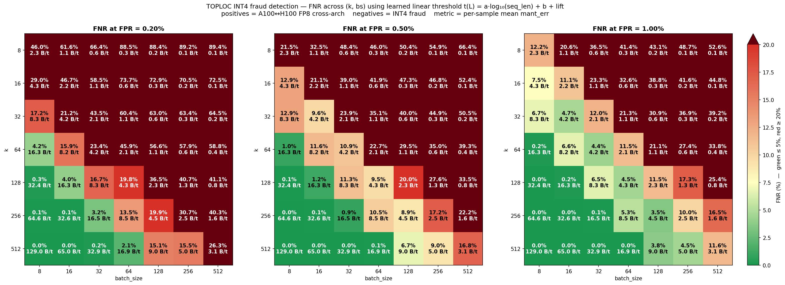
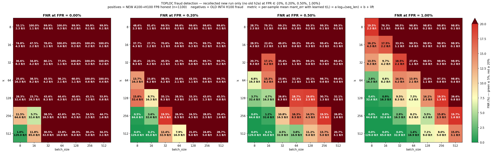
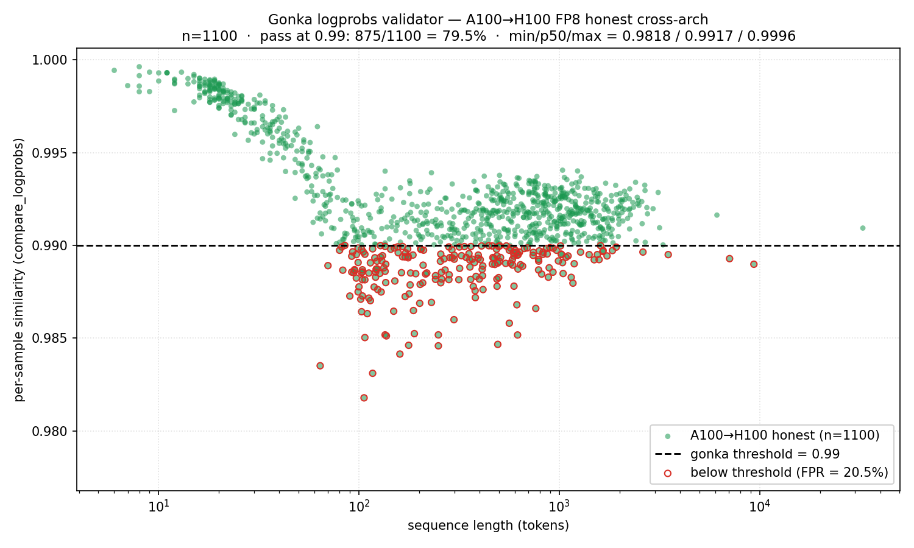

# TOPLOC for Gonka inference validation — research summary

Results from offline TOPLOC benchmarks on Qwen3-235B-A22B-Instruct-2507,
evaluating cross-architecture proof verification (A100 ↔ H100, FP8
weights) against cross-quantization fraud (INT4-served-as-FP8) across 49
(k, decode_batch_size) configurations on 1100 multilingual prompts.


##  TOPLOC in a nutshell

For a batch of B decode tokens, take the top-k indices and bf16 values of
the final hidden state, fit a unique polynomial of degree ≤ k-1 over
GF(p) with p=65497 to those (index, raw-uint16) pairs, and store its `2k+2`
bytes of coefficients. Verification re-computes the same top-k on the
verifier's activations, evaluates the polynomial at those indices, and
compares the resulting bf16 bit patterns field-by-field (exponent +
mantissa). The comparison is bit-level rather than value-level: the
verifier checks whether the exponent integer and the mantissa-bit
distance match, not whether the floating-point values are close.


## Setup

- **Model**: Qwen3-235B-A22B-Instruct-2507 (MoE, 235B total / 22B active,
  hidden_dim=4096, 94 layers, vocab 151 936). FP8 weights + FP8 KV cache
  in vLLM.
- **Negative-control variant**: `Qwen3-235B-A22B-Instruct-2507-INT4-W4A16`
  (community GPTQ INT4 quant of the same checkpoint).
- **Prompts**: 1100  (multilingual Bactrian-X
  +  ~100 long-output prompts). Sequence-length statistics:
  - FP8 H100 free: mean 583 / median 385 / max 9240 tokens
  - FP8 A100 free: mean 590 / median 384 / max 10042 tokens
  - INT4 H100 free: mean 578 / median 374 / max 10004 tokens
- **Hardware**: 4×H100 (Hopper) and 4×A100 (Ampere), TP=4 in both cases.
- **TOPLOC instrumentation**: top-512 hidden states collected per generated
  token; (k, bs) sweep then evaluated **offline** without re-running
  inference (49 configurations: k ∈ {8, 16, 32, 64, 128, 256, 512} ×
  bs ∈ {8, 16, 32, 64, 128, 256, 512}).

### The four runs

| # | Reference (free) | Verification (enforced) | What it tests              |
|:-:|------------------|-------------------------|----------------------------|
| 1 | FP8 / 4×H100     | FP8 / 4×H100            | Same model, same hardware  |
| 2 | INT4 / 4×H100    | FP8 / 4×H100            | Cross-quantization fraud   |
| 3 | FP8 / 4×A100     | FP8 / 4×H100            | Honest cross-architecture  |
| 4 | FP8 / 4×H100     | FP8 / 4×A100            | Reverse cross-architecture |


## Headline error magnitudes

At k=128, bs=128 (~2.2 B/token, picked because k=128 is the TOPLOC paper's
default and the honest/fraud gap is clearly visible at this config):

| Experiment                                | exact% | mean exp_mismatch | mean mant_err |
|-------------------------------------------|-------:|------------------:|--------------:|
| FP8 H100 → FP8 H100 (same node)           | 100.0% |              0.00 |          0.00 |
| FP8 A100 → FP8 H100 (cross-arch)          |   0.0% |              7.00 |          3.12 |
| FP8 H100 → FP8 A100 (cross-arch reverse)  |   0.0% |              6.95 |          3.08 |
| INT4 H100 → FP8 H100 (cross-quantization) |   0.0% |             21.71 |         10.07 |

Two things stand out:

1. **Cross-architecture honest pairs are not bit-exact** but their error
   sits ~3× below the cross-quantization fraud cluster. That is what
   makes a threshold rule possible.
2. **Forward and reverse cross-arch distributions are statistically
   indistinguishable**: 7.00 vs 6.95 mean exp, 3.12 vs 3.08 mean mant
   at this config, and the same near-coincidence holds across all 49
   (k, bs) cells. So a single threshold can be calibrated on a single
   direction and still applied symmetrically.

## Threshold strategy

**Per-sample mean of `mant_err_mean` across that sample's proofs**, with
mantissa overflow (~`2^64` sentinel emitted by the toploc C kernel) clipped
to `MANT_CLIP = 1e6` before averaging. Decision rule:

```
flag as fraud iff   mean_mant > t_mant   ( AND  mean_exp > t_exp  if 2D )
```

The 2D rule helps at k ≤ 64 where mantissa errors occasionally overflow
and become noisier; at k ≥ 256 the mantissa-only rule covers the same
configurations.

Note on threshold choice: using the **maximum** per-sample error of the
honest-control set as a threshold gives no usable separation — it is
dominated by the two persistent A100 outliers (next section), so the
threshold is pulled high enough to admit most fraud. Switching to the
**mean** of per-sample errors and accepting a small FPR
(0.18% / 0.45% / 1.00%) recovers usable separation.

## The detection-quality / proof size

### Heatmap: FNR across (k, bs) at three FPR budgets


(Source: `benchmarks/toploc/fnr_heatmap_lr.py`)

Reading the panels:

- **FNR tracks proof size.** At fixed bytes/token, FNR is roughly the same
  regardless of how that size is split between `k` and `bs` — relaxing
  either knob has the same effect.
- **Relaxing FPR above the 0.2% floor drops the required proof size
  drastically.** At FPR = 0.2% the cheapest acceptable point sits at
  ~17 B/token; at FPR = 0.5% configs at ~4 B/token already work; at
  FPR = 1% the cheap end gets even more headroom. The 0.18% floor is set
  by the two persistent A100 outliers — below that budget no config
  separates honest cross-arch from INT4 fraud cleanly.

### Scatter at FPR = 0.50% — four cheap configs at ~4 B/token


(Source: `benchmarks/toploc/heatmap_scatter_lr.py --fpr 0.005`)

Each panel is one (k, bs) configuration. Green = A100 → H100 honest.
Blue = H100 → A100 honest. Red × = INT4 fraud. Dashed line is the
**learned** threshold `t(L) = a · log₁₀(seq_len) + b + lift`, fitted on
the union of green + blue and lifted so exactly `floor(0.005 · 2200) = 11`
of those points sit above it. Dotted line is the flat (seq-length-independent)
baseline at the same FPR.

The line tilts down or stays flat: for honest cross-arch the
per-sample mean drifts slightly *down* with log seq_len (more proofs
average toward the per-proof mean) while a flat baseline has to be raised
to clear the few long-seq-honest stragglers, leaving room for fraud
to slip below it. The tilt buys a few percentage points of FNR for free
in these cheap configs.

### Scatter at FPR = 0.20% — four configs at ~17 B/token


(Source: `benchmarks/toploc/heatmap_scatter_lr.py --fpr 0.002`)

Tightening FPR from 0.5% → 0.2% pulls the threshold up by ~1
mantissa-error unit. The two persistent A100 outliers now drive most of
the budget, so the 4 B/token configs no longer reach an acceptable FNR
and ~17 B/token configs take their place. At the strict (k=512, bs=8)
reference (130 B/tok, not shown here) FNR remains 0% even at 0.2% FPR —
the cost of going strict is paid in proof size, not detection.


## Sequence-length dependence

False negatives are not uniform across sequence length. Across all
config-sweeps, the FN concentration peaks in the **500–2000 token** bin:

```
seq_len bin    FN rate at k=128/bs=32  (8.5 B/tok, FPR ≤ 0.45%)
  1–20          1.5%
  20–50         1.5%
  50–100        8.2%
  100–200      11.5%
  200–500      24.0%
  500–1000     25.2%
  1000–2000   33.5%   ← worst
  2000–5000   14.3%
  5000–15000   0.0%   (n=3, noisy)
```

Mechanism: at short sequences a few "hot" high-mant_err proofs dominate
the per-sample mean and push it well above threshold. At medium-long
sequences the mean averages over more proofs, the distribution
concentrates at ~9–10 (close to the threshold), and INT4 fraud with
naturally similar dynamics gets harder to separate. Very long
sequences (> 2000 tokens) again separate well because each fraud sample
accumulates enough "hot" proofs to break above threshold reliably.

Implication: the cheapest configs are well-suited for chatbot-style
short-output workloads and progressively less reliable on long-form
generation. Longer outputs benefit from higher `k` more than from smaller
`bs`: at the same proofs/sample budget (bs=32), going k=128 → 256 → 512
drops 1000–2000 token bin FNR from 33.5% → 14.5% → 3.4%.

## Cross-direction symmetry — one threshold, both directions

A single mant_err threshold in the 8.3–9.1 range works for both
A100 → H100 and H100 → A100 directions on the same weights. The
distributions of per-sample mean errors are statistically the same on
both sides; the same two outlier prompts dominate (`idx=605`, `idx=692`,
in slightly different ranks).


## Outliers — why two prompts force an FPR floor

Across all 49 (k, bs) configs, exactly two of the 1100 A100 honest
samples have a normalized `mean_exp / k` score close to 1.0, with a
clear gap to the rest:

| Rank | A100 jsonl idx | seq_len | avg(`mean_exp / k`) over 49 configs |
|-----:|---------------:|--------:|------------------------------------:|
| 1    | 692            |     227 | **0.892** |
| 2    | 605            |    3152 | **0.755** |
| 3    | 226            |     154 |   0.173   |

The cross-arch TOPLOC verification uses enforced decoding (H100 is
forced to consume A100's exact token sequence), so the failure is in
the hidden states rather than in the token streams. The same two
prompts also diverge mid-output under **free** generation:

- **idx=692** (Hindi summarization). A100 free = 227 tokens, H100 free
  = 186. The sequences match for the first 137 positions, then split
  (A100: `42311 116 34370 …`, H100: `54575 47809 54784 …`).
- **idx=605** (Hindi JVM-log explanation). A100 free = 3152 tokens,
  H100 free = 3041. Sequences split at position 65, with only 3.0% of
  aligned positions matching across the rest of the output.

So the underlying model is genuinely behaving differently across A100
and H100 on these two prompts. This is not a TOPLOC-specific failure.

TOPLOC rejects 605 and 692 at 0.18% FPR. Whether the existing gonka
logprobs validator also rejects them is an open question for
additional experiments, since we only stored top-token identities and
not logprob values.

Secondary recurring FPs (idx 23, 1009, 534, 823, 97, …) each show up
in 5–30 configs out of 49 and are well covered by the 0.45% / 1.00%
FPR budgets.


## Recollection on newer vLLM (May 2026)

The full A100 → H100 cross-arch FP8 honest pair (1100 prompts) was
re-collected on a newer vLLM base (`mil/topk-collect-new`, branched from
`tg/scratchpad_for_mode`) with `--logprobs-mode raw_logprobs` so the
verifier returns un-truncated top-20 logprobs. INT4 fraud and the reverse
H100 → A100 direction were not re-collected; comparisons against fraud
below use the original `mil/topk-collect` int4 results. PyTorch kernel versions 
and the vLLM sampler path differ from the
original run, so small numerical shifts are expected.

### Heatmap: TOPLOC FNR on the recollected honest cross-arch pair



(Source: `benchmarks/toploc/fnr_heatmap_lr_recollect.py`)

The structure of the heatmap is unchanged. Honest cross-arch
mean `mant_err` is uniformly ~0.15–0.18 higher on the recollection (e.g.
k=128/bs=128: 3.12 → 3.29). At cheap configs around 4 B/token this
costs 1–6 pp of FNR (k=128/bs=64: 15.1% → 18.7% at FPR=0.5%); at
≥17 B/token cells the separation is essentially identical to the
original. The "two persistent outliers 605/692" finding does **not**
reproduce — those prompts now sit at average ranks 425/1100 and
326/1100 across (k, bs) configs. Outlier identity is sample-dependent
(temperature=0.99 sampling), but the seqlen-bin distribution of
outliers persists.

### Heatmap with FPR=0 — new-only honest



(Source: `benchmarks/toploc/fnr_heatmap_new_only_recollect.py`)

This variant uses only the recollected NEW A100→H100 honest pair (no old
H100→A100 reverse data is mixed in) and adds an **FPR = 0% panel** to the
usual triplet. Without the two persistent outliers (605/692) dragging
the threshold up, FPR = 0 is now a usable regime: at the most strict
k=512 / bs=8 cell (~129 B/tok) FNR remains ~0%, and at ~16 B/tok
configs (k=512 bs=64 or k=256 bs=32) FNR sits around 4–7%. The cost of
forbidding any honest false positive is roughly +13–15 pp of FNR
relative to the same cells at FPR = 0.5% — i.e. the strict regime
needs ~2× the proof size for comparable detection. Below ~4 B/tok the
honest variance still pulls the threshold high enough that ≥30% of
fraud slips below it at FPR = 0.

### Gonka logprobs validator on the recollected pair



(Source: `benchmarks/toploc/scatter_logprobs_recollect.py`)

Each green dot is one prompt; red rings highlight the 225 honest samples
falling below the 0.99 default threshold. The summary numbers across
the 1100-prompt corpus:

```
mean similarity  = 0.9922      pass at 0.99: 875 / 1100 = 79.5 %
p50 = 0.9917     p95 = 0.9984  max = 0.9996
```

Two structural observations:

1. **Long sequences (>2000 tokens) sit just below the 0.99 line.**
   The per-position relative-distance metric averages over many
   positions; the `max(100, n_pos)·K` denominator stops growing past
   100 positions, so the long tail compresses tightly into a band
   around 0.992. Most long-output samples fail the 0.99 threshold by a
   small margin, almost deterministically.
2. **The 100–1000 token range carries most of the variance.** Per-bin
   medians are similar across 50–2000 tokens (~0.991) but the spread
   in 100–1000 is largest, with similarity ranging from ~0.985 to
   ~0.999 within the same bin. Below 50 tokens there are too few
   positions for the distance to accumulate (similarity ≈ 1.0 for
   nearly all); above 2000 the distance is averaged into a tight band.

Together with the TOPLOC FNR-by-seqlen pattern from earlier in this
document, this means the **50–2000 token band is the joint hard zone**
for both validators, by different mechanisms — gonka because per-position
distance accumulates without yet being diluted, TOPLOC because honest
cross-arch mant_err sits closer to the int4 fraud cluster's lower tail
in that range.

The two validators are **statistically uncorrelated** at the per-sample
level: across (k, bs) configs Pearson r between gonka similarity and
TOPLOC mant_err sits in [-0.01, +0.18], Spearman ρ in [-0.11, +0.08].
Gonka measures post-LM-head logprob-distribution drift at agreed
indices; TOPLOC measures pre-LM-head bf16 hidden-state-coordinate
drift at top-K dimensions. Sharing only the forward pass, they're as
independent as two probes can be — a fraudulent run would need to
game both signals simultaneously.

### Practical implication for the gonka threshold

At the gonka default threshold of 0.99, this honest cross-arch pair
yields a **20.5 % false positive rate**. The validator was calibrated
on same-precision same-arch test fixtures (where similarity sits at
~1.000); it has not been calibrated against cross-architecture honest
runs. To admit 100 % of honest cross-arch FP8 pairs the threshold
needs to drop to ~0.98. Either the threshold should be lowered for
cross-arch validation, or the per-position normalization in
`compare_logprobs` (the `max(100, len)·K` denominator and the
`next_logprob = min1 - (min2 - min1)` extrapolation) needs a
calibration pass against multilingual short-output prompts where most
of the failures cluster.
